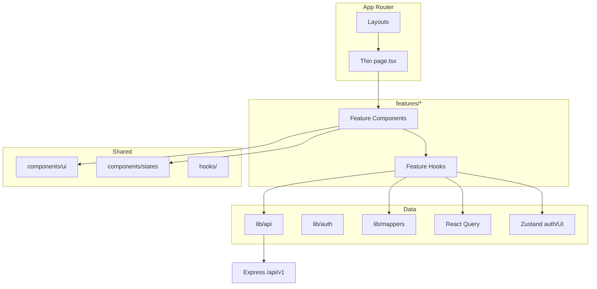
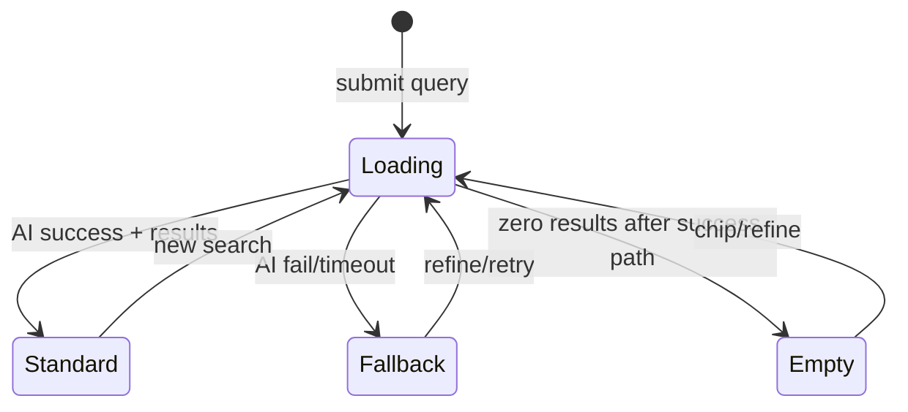
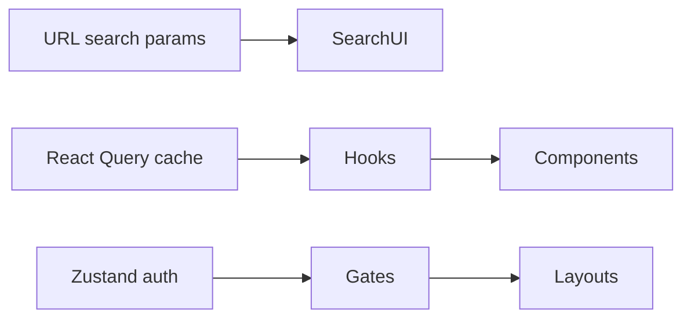
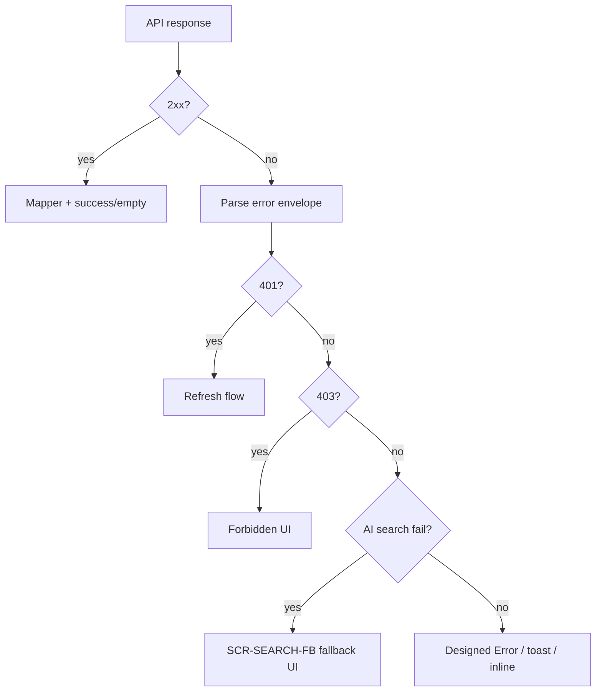

# PropVista CRM / Property AI Studio — Frontend Architecture

| Field | Value |
|-------|--------|
| **Document** | `06_FRONTEND_ARCHITECTURE.md` |
| **Version** | 1.0.0 |
| **Date** | 2026-07-30 |
| **Status** | Binding for frontend implementation |
| **Governance** | `00_PROJECT_CONSTITUTION.md` |
| **System Architecture** | `03_SYSTEM_ARCHITECTURE_DOCUMENT.md` |
| **UI SOT** | `docs/design_reference/**` (HTML wins) |
| **UI Build** | `07_UI_IMPLEMENTATION_GUIDE.md` |
| **Pixel QA** | `16_UI_PIXEL_PERFECT_CHECKLIST.md` |
| **Standards** | `14_CODING_STANDARDS.md` |
| **API Contract** | `05_API_SPECIFICATION.md`, `openapi.yaml` |

---

## 1. Purpose

This document defines the **complete frontend architecture** for the Next.js 15 application (`frontend/`). It operationalizes Constitution rules for:

- Feature-based organization  
- Clean Architecture (no business logic in UI)  
- Centralized API client  
- HTML/pixel fidelity  
- Role-based route gates  
- Gemini AI UX (search/chat/loan) with designed fallbacks  

It does **not** redesign the UI or invent Out-of-MVP screens (Kanban, timeline product, reminders, virtual tours/video, SMS/WhatsApp/push).

---

## 2. Non-Negotiable Constraints (Constitution)

| Rule | Implication for FE |
|------|-------------------|
| Next.js 15 App Router + React 19 + TypeScript strict + Tailwind | Mandatory stack |
| Deploy FE to Vercel | No server APIs that break Vercel FE model; API stays on Express |
| No business logic in components | Hooks + API; server is AuthZ/rules authority |
| All HTTP via `lib/api` | No ad-hoc `fetch`/`axios` in components |
| HTML is UI SOT | Tailwind/tokens match `DESIGN.md`; no redesign |
| Leaflet + OSM only | Maps lazy-loaded on property detail |
| Gemini only | FE never holds Gemini keys; AI via backend |
| Roles only | Client gates UX; server enforces |
| MVP exclusions | No Kanban nav/route in MVP |

---

## 3. High-Level Frontend Model



**Data path:** Page → Feature Component → Feature Hook → `lib/api` → Express → Hook maps DTO → View Model → Component renders HTML states.

---

## 4. Folder Structure

```text
frontend/
  src/
    app/                              # Next.js App Router — routes ONLY (thin)
      layout.tsx                      # Root layout (fonts, providers, globals)
      globals.css
      (public)/
        page.tsx                      # SCR-HOME /
        properties/[id]/page.tsx      # SCR-PROP-D
        search/page.tsx               # SCR-SEARCH-* variants
      (auth)/
        login/page.tsx
        register/page.tsx
      (customer)/
        layout.tsx                    # Customer shell + RequireAuth
        customer/page.tsx             # SCR-CUS-DASH
      (admin)/
        layout.tsx                    # Admin shell + role gate
        page.tsx                      # SCR-CMD /admin
        properties/page.tsx           # SCR-PROP-INV
        properties/new/page.tsx
        properties/[id]/edit/page.tsx # SCR-PROP-EDIT
        properties/bulk/page.tsx      # SCR-BULK
        leads/[id]/page.tsx           # SCR-LEAD-D
        ai-config/page.tsx            # SCR-AI-CFG
        # NO leads/pipeline in MVP
    features/
      auth/
      home/
      search/
      properties/
      favorites/
      customer/
      leads/
      admin/
      ai/
      cms/
      notifications/
      scheduling/
      reports/
    components/
      ui/                             # Button, Input, Modal, Table, Badge, …
      layout/                         # SiteHeader, SiteFooter, AdminSidebar, …
      states/                         # Loader, Skeleton, Empty, Error
    hooks/                            # Cross-feature only (useMediaQuery, …)
    lib/
      api/                            # Centralized client + resource modules
        client.ts
        auth.ts
        properties.ts
        search.ts
        leads.ts
        …
      auth/                           # session helpers, token storage strategy
      mappers/                        # DTO → view models for HTML
      config/                         # public env
    types/                            # shared FE types / DTOs aligned to OpenAPI
    styles/                           # token CSS variables from DESIGN.md
  public/                             # static assets (incl. search icon asset)
  package.json
  next.config.ts
  tailwind.config.ts
  tsconfig.json
```

### Feature module shape

```text
features/<name>/
  components/          # screen sections for this domain
  hooks/               # useXQuery, useXMutation
  types.ts             # feature-local types
  index.ts             # public exports only (prevent cycles)
```

**Rules**

- Route files stay thin: import feature screens, pass params.  
- No deep cross-feature imports; use `features/<x>/index.ts`.  
- `docs/design_reference` is read-only — never imported as runtime HTML.

---

## 5. Routing

### 5.1 App Router conventions

| Concern | Approach |
|---------|----------|
| Framework | Next.js 15 App Router |
| Route groups | `(public)`, `(auth)`, `(customer)`, `(admin)` for layouts without URL segments |
| Dynamic | `[id]` for property/lead/edit |
| Search variants | **One** route `/search`; state/query selects STD / FB / EMPTY |

### 5.2 Route map (MVP)

| SCR | Route | Group | Roles |
|-----|-------|-------|-------|
| SCR-HOME | `/` | public | Guest+ |
| SCR-SEARCH-* | `/search` | public | Guest+ |
| SCR-PROP-D | `/properties/[id]` | public | Guest+ |
| Login/Register | `/login`, `/register` | auth | Guest |
| SCR-CUS-DASH | `/customer` | customer | Customer+ |
| SCR-CMD | `/admin` | admin | Agent subset / Admin / Super Admin |
| SCR-PROP-INV | `/admin/properties` | admin | Agent / Admin / Super Admin |
| SCR-PROP-EDIT | `/admin/properties/new`, `…/[id]/edit` | admin | Agent / Admin / Super Admin |
| SCR-BULK | `/admin/properties/bulk` | admin | Admin / Super Admin |
| SCR-LEAD-D | `/admin/leads/[id]` | admin | Agent / Admin / Super Admin |
| SCR-AI-CFG | `/admin/ai-config` | admin | Admin / Super Admin |
| SCR-LEAD-KANBAN | `/admin/leads/pipeline` | — | **Not in MVP nav** |

### 5.3 Search routing detail



Query params (illustrative): `q`, `page`, filters; UI mode derived from API result (`mode: ai | fallback`) and empty detection—not separate MVP routes.

### 5.4 Guards

```text
app/(customer)/layout.tsx  → RequireAuth (Customer+)
app/(admin)/layout.tsx     → RequireAuth + RequireRole([...])
```

Unauthorized → redirect login; forbidden role → 403 page matching designed error patterns (no Admin chrome leak).

---

## 6. Layouts

| Layout | Responsibility |
|--------|----------------|
| Root `app/layout.tsx` | Fonts, `Providers` (QueryClient, Auth), `globals.css`, token classes |
| Public shell | `SiteHeader` / `SiteFooter` per homepage HTML |
| Customer layout | Customer chrome + notifications bell entry |
| Admin layout | `AdminSidebar` + top bar per command-center / inventory HTML |

**Constitution:** Shared shells must stay consistent across screens that use them. Do not invent alternate admin shells per page.

Layouts contain **structure only**; data loading belongs in feature hooks used by pages/sections.

---

## 7. Components

### 7.1 Layers

| Kind | Location | Rules |
|------|----------|-------|
| Primitives | `components/ui` | Match HTML controls; no domain rules |
| Layout chrome | `components/layout` | Header, footer, sidebar, shells |
| States | `components/states` | Loader, Skeleton, Empty, Error per HTML |
| Feature sections | `features/*/components` | Screen-specific composition |

### 7.2 Naming

- `PascalCase.tsx` matching primary export  
- Screen-aligned names: `SearchResultsStandard`, `PropertyDetailsPremium`, `LeadDetailPanel`  
- Avoid redesign names (`GlassCard`, `FancyHero`)

### 7.3 Server vs Client

- **Server Components** by default for static shells  
- **`'use client'`** only when interactivity required (forms, chat, maps, filters, modals)  
- Never put Prisma or Gemini SDK in components  

### 7.4 Screen → feature mapping

| SCR | Feature module (primary) |
|-----|--------------------------|
| SCR-HOME | `features/home` + `ai` chat widget + `search` entry |
| SCR-SEARCH-* | `features/search` |
| SCR-PROP-D | `features/properties` + `scheduling` + `favorites` |
| SCR-CUS-DASH | `features/customer` + `favorites` + `notifications` |
| SCR-LEAD-D | `features/leads` (MVP subset) |
| SCR-PROP-INV / EDIT / BULK | `features/properties` + `admin` |
| SCR-AI-CFG | `features/ai` |
| SCR-CMD | `features/admin` + `reports` |

---

## 8. Hooks

### 8.1 Rules

- Feature hooks live in `features/<name>/hooks`  
- Shared hooks only in `src/hooks` when reused by 2+ features  
- Hooks call `lib/api`; never raw `fetch`  
- No JSX inside hooks  
- Prefer discriminated union return states  

### 8.2 Patterns

| Type | Example | Responsibility |
|------|---------|----------------|
| Query | `usePropertyDetail(id)` | Load + cache via React Query |
| Mutation | `usePublishProperty()` | Write + invalidate queries |
| Controller | `useSearchController()` | Orchestrate AI/filter/empty modes |
| UI | `useDisclosure()` | Modal open/close |

### 8.3 Async state union (mandatory style)

```ts
type AsyncState<T> =
  | { status: 'idle' }
  | { status: 'loading' }
  | { status: 'success'; data: T }
  | { status: 'empty' }
  | { status: 'error'; error: AppError };

// Search extends with:
// { status: 'fallback'; data: T; reason: string }
```

Components switch on `status` to render designed Loader / Empty / Error / Fallback / Success UI.

---

## 9. State Management

| Concern | Tool | Notes |
|---------|------|-------|
| Server/async data | **React Query** (TanStack Query) | Queries/mutations; cache keys by resource |
| Auth session (client) | **Zustand** (or equivalent thin store) | User, role, hydrated flag — tokens per auth strategy |
| Ephemeral UI | `useState` / URL search params | Tabs, modals, filter draft |
| Form draft | React Hook Form (recommended) | See Forms |

**Do not** put business rules or AuthZ decisions solely in Zustand. Server is authoritative.



Avoid default `useMemo`/`useCallback` unless team/React Compiler guidance requires—follow Coding Standards.

---

## 10. API Layer

### 10.1 Centralized client (`lib/api`)

```text
lib/api/
  client.ts          # baseURL, credentials/headers, refresh, parse envelope
  auth.ts
  properties.ts
  search.ts
  leads.ts
  visits.ts
  favorites.ts
  customer.ts
  notifications.ts
  cms.ts
  metrics.ts
  aiConfig.ts
  bulk.ts
  users.ts
  agents.ts
```

**Rules (Constitution §18)**

- Components → hooks → `lib/api/*` only  
- One auth header/cookie strategy  
- Parse `{ error: { code, message, details } }` uniformly  
- Temporary mocks must match OpenAPI and be ticketed for removal  

### 10.2 Client responsibilities

| Task | Implementation |
|------|----------------|
| Base URL | `NEXT_PUBLIC_API_BASE_URL` → `/api/v1` |
| 401 handling | Attempt refresh once; else logout + redirect |
| Timeouts | Especially AI search/chat/loan |
| Upload | `FormData` for media via properties API module |

### 10.3 No BFF business logic by default

Next.js talks to Express. Do not re-implement domain rules in Route Handlers unless Architecture explicitly adds a BFF exception.

---

## 11. Services (Frontend)

Frontend **does not** host domain services (those are Express). FE “services” mean:

| Name | Location | Role |
|------|----------|------|
| API resource modules | `lib/api/*` | Transport + typing |
| Mappers | `lib/mappers/*` | DTO → HTML-oriented view models |
| Auth helpers | `lib/auth/*` | Session read, logout, role checks for **UI** |
| Formatters | `lib/utils` or `utils` | dates, price display (presentation only) |

**Forbidden FE “services”:** lead scoring, publish eligibility, Gemini prompt building, password hashing.

---

## 12. Utilities

| Utility | Purpose |
|---------|---------|
| `cn()` / class merge | Compose Tailwind classes matching HTML clusters |
| Price/date formatters | Display only; amounts remain API decimal strings until format |
| Query-key factories | `propertyKeys.detail(id)` for React Query |
| Env guard | Fail fast if `NEXT_PUBLIC_API_BASE_URL` missing in runtime |
| A11y helpers | `id`/`htmlFor` pairing helpers without visual change |

Keep utils pure and tiny. Domain validation schemas that mirror API may live shared—but server remains authoritative.

---

## 13. Forms

| Concern | Approach |
|---------|----------|
| Library | React Hook Form recommended for complex forms (login, listing editor, AI config, lead capture) |
| UX | Labels, spacing, validation messages **match HTML** |
| Submit | Call mutation hooks; disable button per designed loading state |
| Listing editor | Draft vs Publish actions as HTML; **no** video/virtual tour fields in MVP |
| Modals | `ScheduleVisitModal`, Add Lead, Loan Analysis — feature components |

Forms never call Express validators directly; they call FE validation then API.

---

## 14. Validation

### 14.1 Layers

1. **UI validation** — mirrors HTML/Requirements for instant feedback  
2. **API validation** — authoritative; FE must display `error.details[]`  

### 14.2 FE validation approach

- Zod (or equivalent) schemas colocated with forms or `features/*/schemas.ts`  
- Map Zod errors to inline field messages matching designed placement  
- Enum roles/statuses align with OpenAPI  

### 14.3 Never trust FE alone

Role escalation, publish rules, bulk import validity are **server** decisions.

---

## 15. Error Handling



| Rule | Detail |
|------|--------|
| Envelope | Always parse `error.code` / `message` / `details` |
| UI | Prefer HTML error/empty/fallback regions over generic alerts |
| Console | No errors on verified flows (DoD) |
| Secrets | Never surface tokens/stacks to users |
| AI search | Failure → fallback view, not blank page |
| Loan | Formula fallback path when API signals AI unavailable |

---

## 16. Loading States

| Pattern | When |
|---------|------|
| Full-section skeleton | Initial page/data (inventory, search, detail) |
| Inline spinner | Button submit, chat send |
| Route `loading.tsx` | Optional; must not diverge from designed skeletons |
| Keep chrome visible | Header/sidebar stay mounted while main content loads (per HTML) |

Search loading must match SCR-SEARCH loading treatment before STD/FB/EMPTY.

Discriminated `status: 'loading'` drives these components—do not leave white blank screens where HTML shows loaders.

---

## 17. Theme

| Source | Use |
|--------|-----|
| `design_reference/propvista_crm/DESIGN.md` | Colors, type, radii, shadows |
| `styles/tokens.css` + Tailwind theme extend | CSS variables / theme keys |
| HTML class clusters | Reproduce in components; extract repeats into primitives |

**Forbidden:** purple-glow AI aesthetic restyles, icon set swaps, “cleaner cards,” spacing normalization that diverges from HTML.

Brand (PropVista) must remain hero-level on homepage per design rules—architecture must not force a dashboard-first home.

---

## 18. Responsive Strategy

| Breakpoint | Width | Requirement |
|------------|-------|-------------|
| Mobile | ~375px | Match HTML stacking |
| Tablet | ~768px | Match HTML |
| Desktop | ~1280px+ | Match `screen.png` |

Strategy:

1. Implement desktop fidelity first against `screen.png`  
2. Apply HTML responsive behaviors (Tailwind breakpoints as in reference)  
3. Verify with `16_UI_PIXEL_PERFECT_CHECKLIST.md`  

Admin tables: follow HTML overflow/scroll pattern—do not invent card redesigns unless HTML does.

---

## 19. Component Reuse

### Mandatory reuse (Constitution §4.5)

- UI primitives (Button, Input, Modal, Table, badges)  
- States (Loader, Empty, Error, Skeleton)  
- Layout chrome (Header, AdminSidebar)  
- Hooks for auth, pagination, notifications bell  
- `lib/api` modules  

Duplicated fetch logic, one-off buttons that already exist, or divergent role gates are **defects**.

### Reuse decision

```text
Need control?
  → Exists in components/ui matching HTML? Use it
  → Else extract from HTML once into components/ui
  → Domain composition stays in features/*
```

---

## 20. Performance Strategy

| Tactic | Application |
|--------|-------------|
| RSC by default | Reduce client JS on static shells |
| Code-split Client islands | Search, chat, maps, heavy admin charts |
| Lazy Leaflet | `dynamic(() => import(...), { ssr: false })` on property detail only |
| React Query | Cache property/lead lists; stale-while-revalidate sensibly |
| Image sizing | Next/Image or HTML-equivalent sizing; avoid CLS vs reference |
| AI non-blocking | Keep chrome interactive; show designed loading |
| Bundle hygiene | Do not load admin chart libs on public homepage |
| NFR | Primary routes target &lt;2s on reference broadband without stripping fidelity |

**Do not** “optimize” by removing HTML-required imagery or motion.

---

## 21. Authentication & Authorization (FE)

| Concern | FE behavior |
|---------|-------------|
| Login/Register | Forms → `lib/api/auth` |
| Session | Store user+role; prefer httpOnly cookie architecture when enabled |
| Refresh | `lib/api/client` interceptor |
| Logout | Clear client state + API logout |
| `RequireAuth` | Redirect unauthenticated |
| `RequireRole` | Hide/block admin routes for wrong role |
| Favorite as Guest | Prompt login (do not fake success) |

AuthZ **always** re-checked on server; FE gates are UX only.

---

## 22. AI Surfaces (FE)

| Surface | Feature | Notes |
|---------|---------|-------|
| Home chat widget | `features/ai` | Open/close, messages, greeting from config |
| NLP search | `features/search` | Scores/reasons; fallback/empty states |
| Loan modal | `features/ai` | Formula fallback UX |
| AI config admin | `features/ai` | Preview chat; **no** provider switcher |

Gemini keys never appear in `NEXT_PUBLIC_*` or client bundles.

---

## 23. Providers Composition

```tsx
// app/providers.tsx (client)
<QueryClientProvider>
  <AuthProvider>      {/* Zustand or context bridge */}
    {children}
  </AuthProvider>
</QueryClientProvider>
```

Root layout wraps children with `Providers`. No business services in providers.

---

## 24. Testing Expectations (FE)

Per `11_TEST_STRATEGY.md`:

| Level | FE focus |
|-------|----------|
| Component | RTL for state switching (loading/empty/error) |
| E2E | Auth, search STD/FB, inquire, admin publish |
| Manual | Pixel Perfect checklist per SCR |

---

## 25. Out-of-MVP Frontend Guardrails

| Item | FE rule |
|------|---------|
| Kanban | No nav link; no MVP route activation |
| Timeline/reminder products | Do not wire backends; lead detail MVP subset only |
| Video / virtual tour | Omit controls from listing editor |
| SMS / WhatsApp / Push | Absent from notification settings UI |

---

## 26. Definition of Frontend Slice Complete

A FE feature/screen is complete only when:

- [ ] Matches `design_reference` HTML + screenshot (Pixel Perfect)  
- [ ] Routing/layout per this document  
- [ ] Hooks + `lib/api` only (no business logic in UI)  
- [ ] Loading / empty / error / hover / focus implemented  
- [ ] Responsive verified  
- [ ] Real API integrated (or tracked mock not claimed Done)  
- [ ] Role gates correct  
- [ ] Lint/TS clean; no console errors  
- [ ] Code review + QA per Constitution  

---

## 27. Related Documents

| Doc | Use |
|-----|-----|
| `00_PROJECT_CONSTITUTION.md` | Binding FE rules |
| `03_SYSTEM_ARCHITECTURE_DOCUMENT.md` | System context |
| `07_UI_IMPLEMENTATION_GUIDE.md` | Per-screen checklist |
| `16_UI_PIXEL_PERFECT_CHECKLIST.md` | Verification |
| `14_CODING_STANDARDS.md` | Naming, React/Next standards |
| `17_API_CHECKLIST.md` | API consumption contracts |
| `05_API_SPECIFICATION.md` / OpenAPI | Endpoints |

---

## 28. Revision History

| Version | Date | Notes |
|---------|------|-------|
| 1.0.0 | 2026-07-30 | Initial Frontend Architecture per Constitution |

---

**End of Frontend Architecture**

*HTML fidelity and Clean Architecture layers are not optional.*
