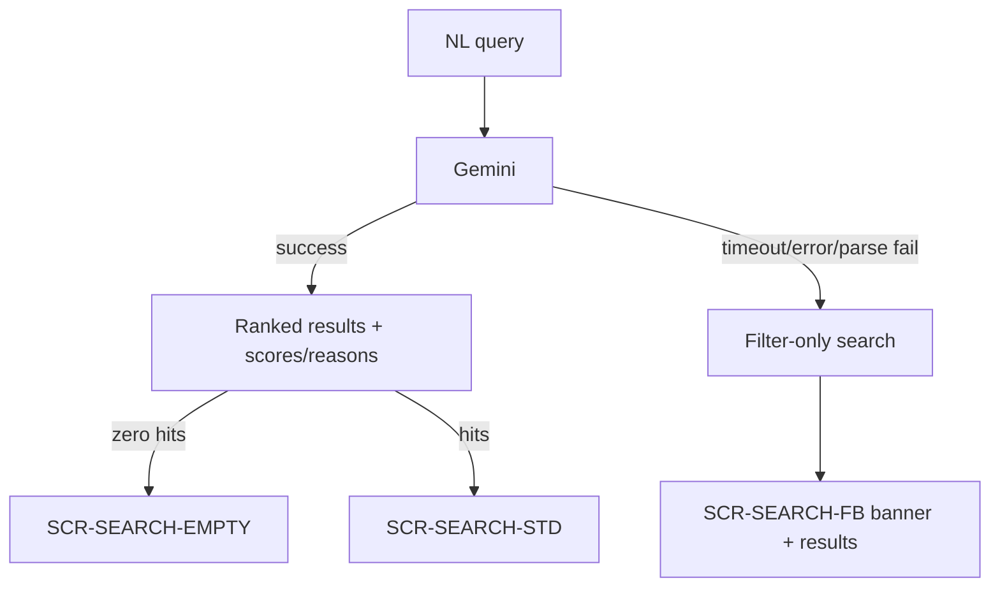

# PropVista CRM / Property AI Studio — AI Development Rules

| Field | Value |
|-------|--------|
| **Document** | `13_AI_DEVELOPMENT_RULES.md` |
| **Version** | 1.0.0 |
| **Date** | 2026-07-30 |
| **Governance** | `00_PROJECT_CONSTITUTION.md` §23 |
| **Architecture** | `03_SYSTEM_ARCHITECTURE_DOCUMENT.md` (AI + Gemini sections) |
| **API** | `05_API_SPECIFICATION.md`, `openapi.yaml` |
| **UI** | `07_UI_IMPLEMENTATION_GUIDE.md`, `design_reference` |

---

## 1. Purpose

Binding rules for all AI features in Property AI Studio. Engineers and AI coding assistants must follow this document together with the Constitution. Violations are stop-the-line defects.

---

## 2. Provider Policy (Absolute)

| Rule | Detail |
|------|--------|
| **Only Google Gemini** | Product AI engine is Gemini exclusively |
| No silent switching | Do not build multi-provider abstractions that enable OpenAI/Anthropic/Bedrock as runtime AI |
| No client secrets | `GEMINI_API_KEY` never in browser, `NEXT_PUBLIC_*`, or git |
| Official SDK | `@google/genai` or official Google Gemini SDK on the **server** |

**Forbidden:** Using another LLM as “fallback when Gemini fails.” Use **non-AI filter fallback** for search and **formula fallback** for loan analysis instead.

---

## 3. MVP AI Product Features

| Feature | Behavior | FE surface |
|---------|----------|------------|
| **AI Search** | NL → ranked properties + match scores/reasons when available | `/search` STD view |
| **AI Chat** | Conversational assistant | Homepage widget + config preview |
| **Loan Analysis** | Affordability/mortgage analysis | Loan modal |

Admin configures chatbot behavior via `SCR-AI-CFG` (`ai_chatbot_configuration` HTML).

---

## 4. Search: Success, Timeout, Fallback

| Rule | Requirement |
|------|-------------|
| Timeout | Mandatory on Gemini calls |
| Fallback | Filter-only path + **visible** fallback banner (HTML) |
| Empty | Designed empty state — not a blank page |
| Inventory | Never fabricate properties not returned by APIs |
| Rate limit | Stricter limits on AI search endpoints |

---

## 5. Chat Rules

- Messages go Backend → Gemini → response DTO → FE widget.  
- Welcome/greeting comes from persisted `ai_configs` when set.  
- Loading and error states match HTML.  
- Do not execute unverified tool writes that mutate inventory without API authority.  
- Log failures server-side; user-safe messages only on client.

---

## 6. Loan Analysis Rules

- Primary path: Gemini analysis.  
- On Gemini failure: **formula fallback** (Requirements).  
- Never leave the user with a blank failure.  
- Validate inputs server-side.

---

## 7. Admin AI Configuration

| Allowed | Not allowed |
|---------|-------------|
| Greeting / welcome text | Alternate LLM provider dropdown (or constrain to Gemini-only labels) |
| FAQ library | Shipping Bedrock/OpenAI integrations |
| Escalation rules + working hours | Client-side prompt secrets |
| Tone / prompt parameters for Gemini | Redesigning SCR-AI-CFG layout |
| Preview chat using saved config | |

Configuration is persisted and applied by the backend without redeploy for overlay fields as designed.

If HTML shows a non-Gemini vendor control: **interpret as Gemini-only** (constrain options or PO-approved label-preserving copy)—do not integrate other vendors.

---

## 8. Architecture Placement

| Layer | AI responsibility |
|-------|-------------------|
| FE components | Render chat/search/loan UI; call hooks |
| FE hooks | Call `lib/api` search/chat/loan/aiConfig |
| Express routes | Validate, authz, call services |
| Services | Orchestrate Gemini + domain ranking/fallback |
| `integrations/gemini` | SDK adapter, timeouts, error mapping |
| Config store | `ai_configs` table via repository |

**No Gemini calls from React.** No business ranking rules only on the client.

---

## 9. Security

- [ ] Key only in server env  
- [ ] Admin AI config routes role-gated  
- [ ] Rate limit auth + AI  
- [ ] Do not log raw keys or full secrets in prompts/logs  
- [ ] Prompt-injection awareness: do not trust model output to bypass AuthZ  

---

## 10. Reliability & Cost

| Practice | Requirement |
|----------|-------------|
| Timeouts | All Gemini calls |
| Monitoring | Latency + fallback rate hooks |
| Usage | Monitor quota/cost in staging/prod |
| CI | Mock Gemini at adapter boundary |
| Release candidate | Recorded sandbox check with real Gemini (limited) |

---

## 11. Testing Requirements

| Level | Expectation |
|-------|-------------|
| Unit | Ranking helpers, loan formula fallback |
| Integration | Mocked Gemini success + fail envelopes |
| UI | STD / FB / EMPTY search; chat open/send; loan fallback |
| Negative | No alternate provider in UI |

See `11_TEST_STRATEGY.md` AI packs.

---

## 12. Definition of AI Feature Complete

- [ ] Gemini-only path implemented server-side  
- [ ] Timeouts + structured errors  
- [ ] Designed fallback/empty UX for search  
- [ ] Formula fallback for loan when applicable  
- [ ] Config applied for chat greeting/preview  
- [ ] Keys absent from client bundle  
- [ ] OpenAPI updated  
- [ ] Tests with mocks green; RC sandbox noted  
- [ ] HTML fidelity for AI screens/widgets  

---

## 13. Related Documents

| Doc | Use |
|-----|-----|
| `00_PROJECT_CONSTITUTION.md` §23 | Binding AI rules |
| `03_SYSTEM_ARCHITECTURE_DOCUMENT.md` | AI layer + Gemini integration |
| `06_FRONTEND_ARCHITECTURE.md` | FE AI surfaces |
| `07_UI_IMPLEMENTATION_GUIDE.md` | SCR-SEARCH-*, SCR-AI-CFG, homepage chat |
| `17_API_CHECKLIST.md` | AI endpoint verification |

---

## 14. Revision History

| Version | Date | Notes |
|---------|------|-------|
| 1.0.0 | 2026-07-30 | Extracted/expanded from Constitution §23 |

---

**End of AI Development Rules**
