# Property AI Studio — Production Architecture

> **SUPERSEDED — Do not use for implementation.**  
> Canonical document: [`03_SYSTEM_ARCHITECTURE_DOCUMENT.md`](./03_SYSTEM_ARCHITECTURE_DOCUMENT.md).  
> This file is retained only as a historical duplicate and will be removed after docs freeze.

| Field | Value |
|-------|--------|
| **Document** | Production Architecture Design (**superseded**) |
| **Product** | Property AI Studio (UI: PropVista CRM) |
| **Version** | 1.0.0 (superseded by `03` v1+) |
| **Date** | 2026-07-30 |
| **Status** | **NON-BINDING** — use `03_SYSTEM_ARCHITECTURE_DOCUMENT.md` |
| **Sources** | `00_PROJECT_CONSTITUTION.md`, `01_PRODUCT_REQUIREMENTS_DOCUMENT.md`, `02_SOFTWARE_REQUIREMENTS_SPECIFICATION.md` |

---

## 1. Purpose and Constraints

This document defines the **production software architecture** for Property AI Studio. It translates Constitution process/stack rules, PRD scope, and SRS requirements into implementable structure.

**Non-negotiable constraints:**

- Stack: Next.js 15, React 19, TypeScript, Tailwind, Node.js, Express, Prisma, PostgreSQL, Google Gemini only, Leaflet + OSM, Vercel (frontend)
- Auth: email + password; JWT access + refresh
- Notifications MVP: email + in-app only
- Single organization; role-based only (Guest, Customer, Agent, Admin, Super Admin)
- Clean Architecture; no business logic in UI; centralized API client
- UI fidelity to `design_reference` HTML (architecture must not force redesign)
- MVP exclusions remain out of architecture activation: Kanban, activity timeline product, reminders, automation, virtual tours, video upload, SMS, WhatsApp, push, multi-tenancy

---

## 2. High-Level Architecture

### 2.1 Context Diagram

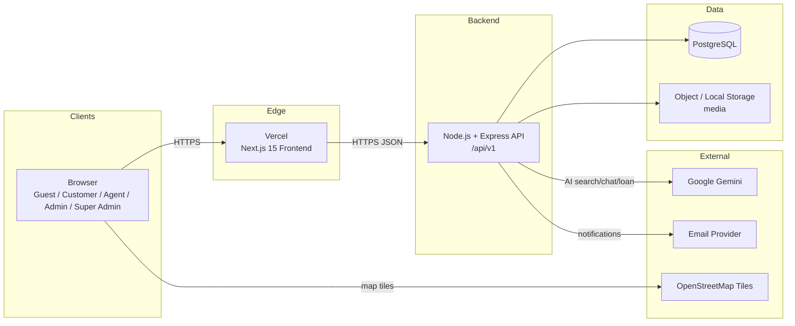

### 2.2 Logical Tiers

| Tier | Responsibility |
|------|----------------|
| Presentation | Next.js App Router pages + feature UI matching HTML |
| Application (client) | Feature hooks, mappers, auth store, React Query/Zustand as used |
| Transport | Centralized API client |
| API / Interface adapters | Express routes, middleware, DTO validation |
| Application (server) | Domain services, use-cases, RBAC checks |
| Domain | Business rules, entities/policies |
| Infrastructure | Prisma repos, Gemini client, email, storage, config, logging |

### 2.3 Request Path (Happy Path)

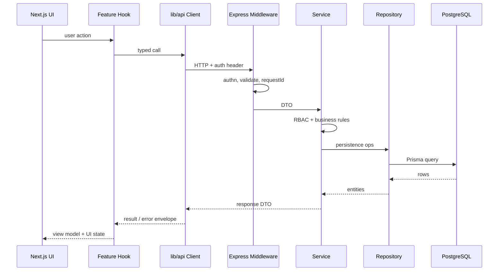

---

## 3. Clean Architecture

### 3.1 Dependency Rule

Dependencies point **inward**. Infrastructure and UI depend on application/domain abstractions—not the reverse.

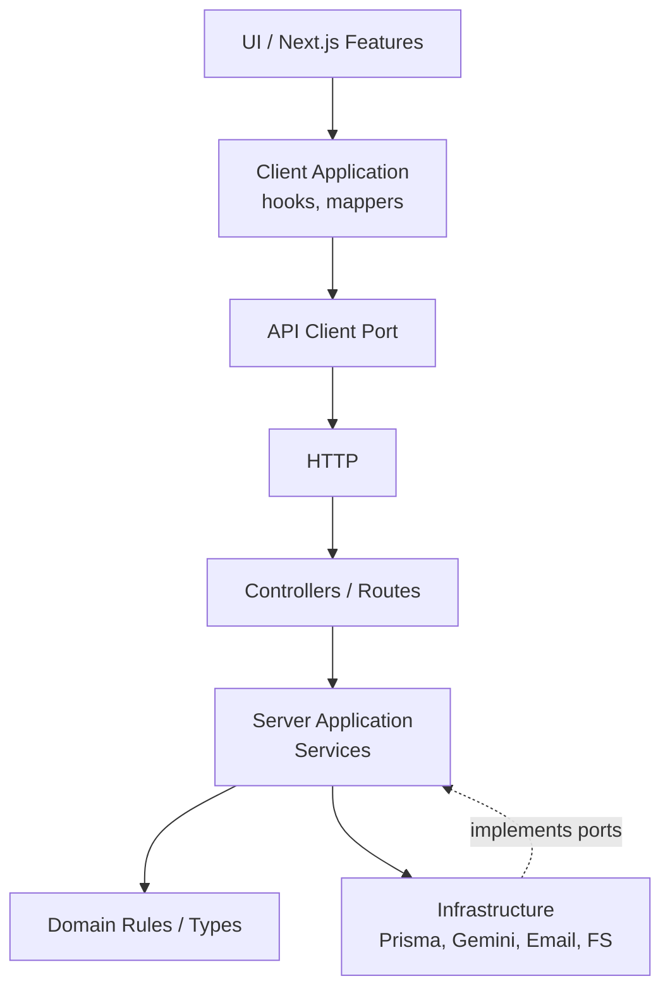

### 3.2 Layer Rules (Constitution)

| Layer | Allowed | Forbidden |
|-------|---------|-----------|
| UI Component | Render, local UI state, call hooks | Business rules, Prisma, Gemini, ad-hoc fetch |
| Hook | Orchestration, cache, map to VM | JSX, DB access |
| Route | Parse/validate, call service, map HTTP | Fat business logic |
| Service | Business rules, RBAC, orchestration | React, raw SQL sprawl |
| Repository | Persistence queries | Authorization policy |
| Integrations | Gemini/email/storage adapters | UI concerns |

### 3.3 SOLID / DRY / KISS / YAGNI

- Feature modules own their use-cases; shared kernels stay thin
- One API client; shared error/types
- Do not build excluded MVP modules “just in case”
- Prefer explicit services over clever generics unless reuse is proven

---

## 4. Folder Structure

### 4.1 Monorepo Layout

```text
/
  docs/                          # Constitution, PRD, SRS, Architecture, design_reference
  frontend/                      # Next.js 15 App Router
  backend/                       # Express + Prisma
  package.json / pnpm-workspace  # optional workspace root
```

### 4.2 Frontend Structure (Feature-Based)

```text
frontend/
  src/
    app/                         # routes only (thin)
      (public)/
      (auth)/
      (customer)/
      (admin)/
      layout.tsx
      globals.css
    features/
      auth/
      home/
      search/
      properties/
      favorites/
      customer/
      leads/
      admin/
      ai/
      cms/
      notifications/
      scheduling/
      reports/
    components/                  # shared presentational primitives matching HTML
      ui/
      layout/
      states/                    # loading/empty/error
    hooks/                       # truly cross-feature hooks
    lib/
      api/                       # centralized client + resource modules
      auth/
      mappers/
      config/
    types/
    styles/                      # tokens from design_reference
  public/
  package.json
  next.config.ts
  tailwind.config.ts
  tsconfig.json
```

**Feature folder convention:**

```text
features/<name>/
  components/
  hooks/
  types.ts
  index.ts                       # public exports only
```

### 4.3 Backend Structure

```text
backend/
  src/
    server.ts / app.ts
    config/
    routes/
      index.ts                   # mounts /api/v1
      auth.routes.ts
      properties.routes.ts
      leads.routes.ts
      ai.routes.ts
      ...
    middleware/
      auth.ts
      requireRole.ts
      validate.ts
      errorHandler.ts
      requestId.ts
      rateLimit.ts
      requestLogger.ts
    services/
      auth.service.ts
      property.service.ts
      search.service.ts
      ai/
        gemini.client.ts
        search.orchestrator.ts
        chat.service.ts
        loan.service.ts
      lead.service.ts
      notification.service.ts
      cms.service.ts
      metrics.service.ts
      media.service.ts
    repositories/
      user.repository.ts
      property.repository.ts
      lead.repository.ts
      ...
    validators/                  # zod/joi schemas
    domain/                      # pure rules, enums, policies
      roles.ts
      propertyStatus.ts
      leadStages.ts
      errors.ts
    integrations/
      email/
      storage/
      gemini/
    utils/
    types/
  prisma/
    schema.prisma
    migrations/
    seed.ts
  package.json
  tsconfig.json
```

### 4.4 Shared Contracts (Recommended)

Prefer duplicated DTO types kept in sync via OpenAPI/export, or a thin `packages/contracts` if monorepo tooling exists. Contracts must not pull React or Prisma into each other.

---

## 5. Frontend Architecture

### 5.1 Rendering Model

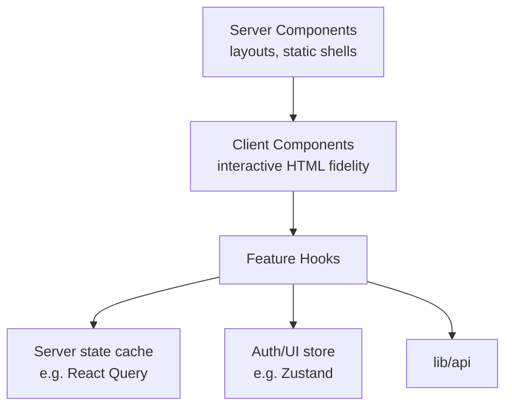

- Default to Server Components for shells where possible
- Client Components for designed interactivity (search, chat, forms, maps)
- **No business rules in JSX** beyond trivial conditionals

### 5.2 UI Fidelity Architecture

- Tailwind theme extends tokens from `design_reference/propvista_crm/DESIGN.md`
- Shared `components/ui` mirrors HTML primitives (Button, Input, Modal, Table, badges)
- Screen-level components live under `features/*` and map 1:1 to SCR-* screens
- UI state machine per view: `idle | loading | success | empty | error` (+ search `ai | fallback`)

### 5.3 Data Flow Pattern

1. Page composes feature components  
2. Hook loads/mutates via `lib/api/<resource>`  
3. Mapper converts DTO → view model shaped for HTML  
4. Component renders designed states  

### 5.4 Maps

- Leaflet + OSM loaded only on property detail (and any HTML-required map surfaces)
- Dynamic import to avoid bundle cost on non-map routes

### 5.5 Auth on Client

- Auth provider/store holds user + tokens (prefer httpOnly cookies when architecture allows; otherwise secure token strategy per SRS)
- `RequireAuth` / role gates for route segments
- Server remains source of truth for authorization

---

## 6. Backend Architecture

### 6.1 Express Composition Root

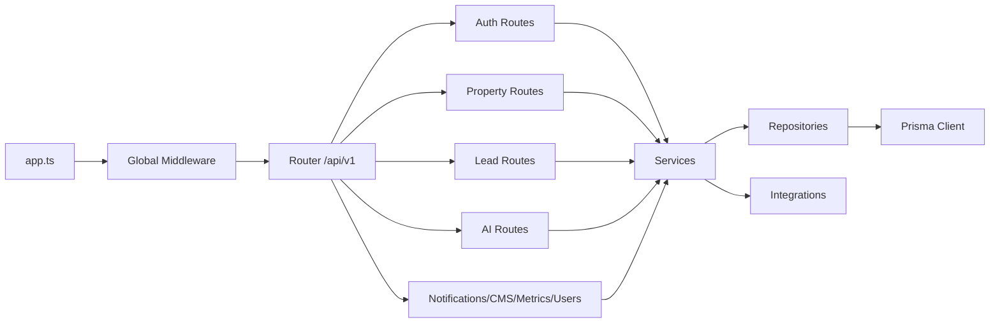

### 6.2 Route → Service → Repository

- Routes stay thin
- Services own transactions/orchestration (Prisma `$transaction` when multi-write)
- Repositories encapsulate queries/`include`/`select` to prevent N+1

### 6.3 Domain Policies (examples)

- `canPublishProperty(input)` required fields  
- `assertRole(user, allowed[])`  
- `propertyVisibleToPublic(status === published)`  
- `leadIdempotencyReplay(key)`  

---

## 7. Database Architecture

### 7.1 ER Overview (MVP)

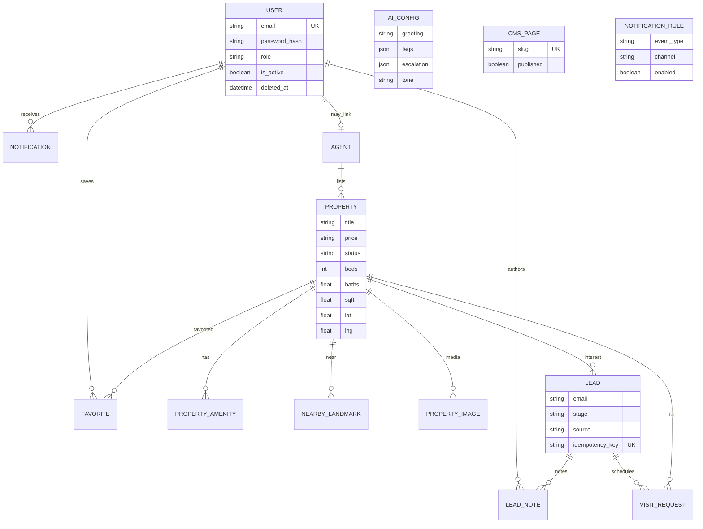

### 7.2 Prisma Strategy

- `schema.prisma` is persistence SOT  
- All changes via migrations  
- Seeds for demo inventory/leads/admin  
- Indexes: `users.email`, `properties.status`, price/geo filters, `leads.stage`, `leads.idempotency_key`, `favorites(user_id,property_id)` unique  

### 7.3 Status Models

**Property:** `draft → published → archived` (and archive/delete policies per SRS)  
**Lead stages:** basic workflow strings (non-Kanban MVP); Kanban WIP tables not introduced  

### 7.4 Storage

- Dev: local disk via storage adapter  
- Prod: storage adapter swap (S3-compatible or equivalent) **without changing API URL contract shapes** returned to UI  

---

## 8. API Layer

### 8.1 Public Surface

Base: `/api/v1`

| Area | Examples |
|------|----------|
| Auth | `/auth/register`, `/auth/token`, `/auth/refresh`, `/auth/me` |
| Properties | `/properties`, `/properties/featured`, `/properties/:id`, media/amenities/landmarks |
| Search/AI | `/ai/search`, `/search/suggest`, `/ai/chat`, `/ai/loan-analysis`, `/health` |
| Favorites | `/favorites` |
| Leads | `/leads`, `/leads/:id`, `/leads/:id/stage`, notes, visits |
| Admin | users, agents, cms, notifications, rules, metrics, ai/config, bulk |

### 8.2 Frontend API Module Layout

```text
lib/api/
  client.ts          # fetch wrapper, auth header, error parse
  auth.ts
  properties.ts
  search.ts
  ai.ts
  leads.ts
  favorites.ts
  notifications.ts
  cms.ts
  admin.ts
  types.ts
  index.ts
```

### 8.3 Response Conventions

Success list:

```json
{ "data": [], "meta": { "page": 1, "pageSize": 20, "total": 0, "totalPages": 0 } }
```

Error:

```json
{ "error": { "code": "VALIDATION_ERROR", "message": "...", "details": [] } }
```

AI search modes: `mode: "ai" | "fallback"` per SRS.

### 8.4 Mock Policy

Temporary contract-compatible mocks allowed only until backend readiness; tracked and removed before Done (Constitution).

---

## 9. Authentication

### 9.1 Flow

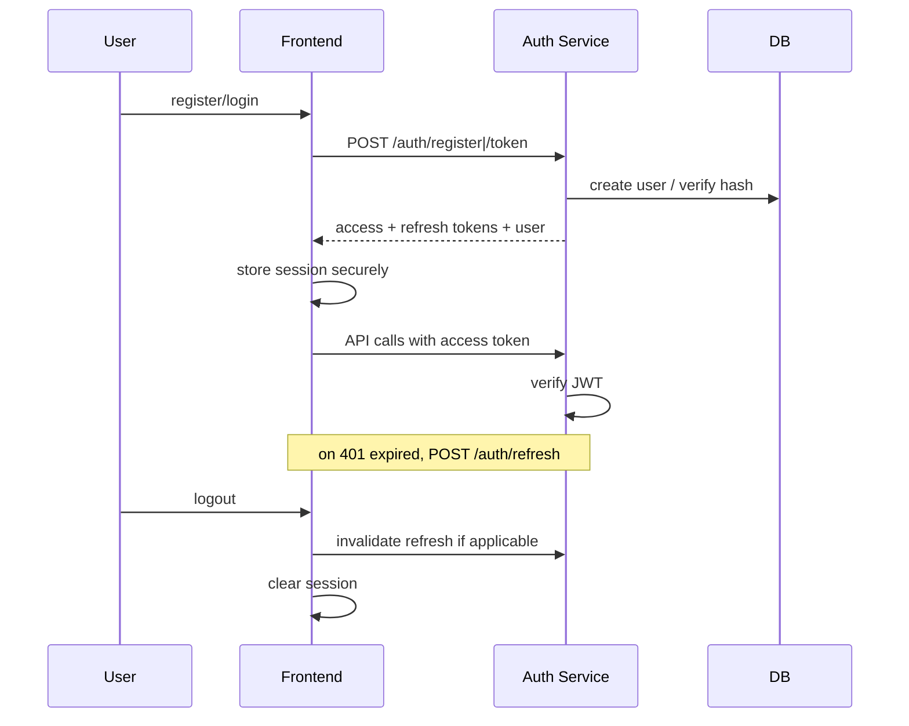

### 9.2 Design Choices

| Topic | Decision |
|-------|----------|
| Credentials | Email + password |
| Hashing | bcrypt or argon2 |
| Tokens | Access (short) + refresh (longer) |
| Inactive/soft-deleted | Cannot authenticate |
| Secrets | Env only; never in frontend bundle |

### 9.3 Registration Default Role

New public registrations create **Customer** unless Admin provisions other roles.

---

## 10. Authorization (RBAC)

### 10.1 Model

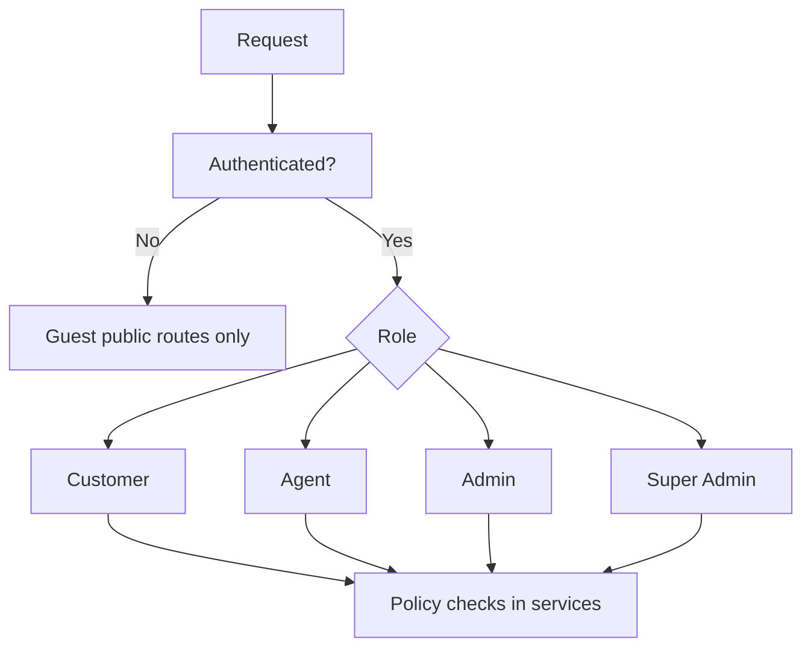

**No module-level permission tables.** Capabilities derive from role (+ ownership/assignment for Agent).

### 10.2 Middleware

- `authenticate` — attach user or 401  
- `requireRole('admin','super_admin')` — 403 otherwise  
- Service-level `assertAgentOwnsProperty` / `assertLeadAccess`  

### 10.3 Role Summary

| Role | Architectural notes |
|------|---------------------|
| Guest | Public GETs + register + lead capture + chat/search |
| Customer | Favorites, dashboard, loan, own inquiries |
| Agent | Own/assigned properties & leads; limited admin shell |
| Admin | Org users/agents/CMS/AI config/rules/reports/bulk |
| Super Admin | Full data + future audit surfaces |

---

## 11. AI Layer

### 11.1 Placement

AI is an **infrastructure integration** consumed by application services. UI never calls Gemini directly.

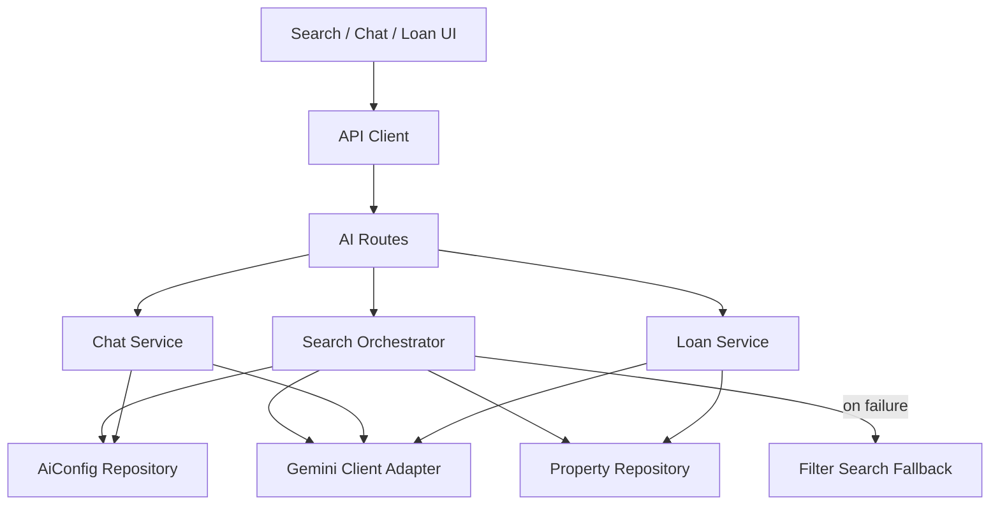

### 11.2 Responsibilities

| Component | Responsibility |
|-----------|----------------|
| `GeminiClient` | SDK wrapper, timeouts, retries (safe), metrics |
| `SearchOrchestrator` | Prompt + property corpus subset + parse scores/reasons; fallback |
| `ChatService` | Greeting/FAQ/escalation from AiConfig; Gemini replies |
| `LoanService` | Gemini analysis; formula fallback |
| `AiConfigService` | Admin CRUD; hot-read by runtime services |

### 11.3 Fallback Contract

On Gemini timeout/error for search:

1. Log `ai.search.fallback`  
2. Run filter-only query  
3. Return `mode: "fallback"` + banner message for HTML  

Never invent property rows not in DB.

---

## 12. Gemini Integration

### 12.1 Adapter Interface (conceptual)

```ts
interface GeminiClient {
  generateText(input: { system?: string; prompt: string; timeoutMs: number }): Promise<string>;
}
```

- Implementation uses official Google Gemini SDK / `@google/genai`  
- API key from `GEMINI_API_KEY` only  
- Rate-limit AI routes  
- Structured prompt templates versioned in code + admin overlays from AiConfig  

### 12.2 Search Orchestration Algorithm

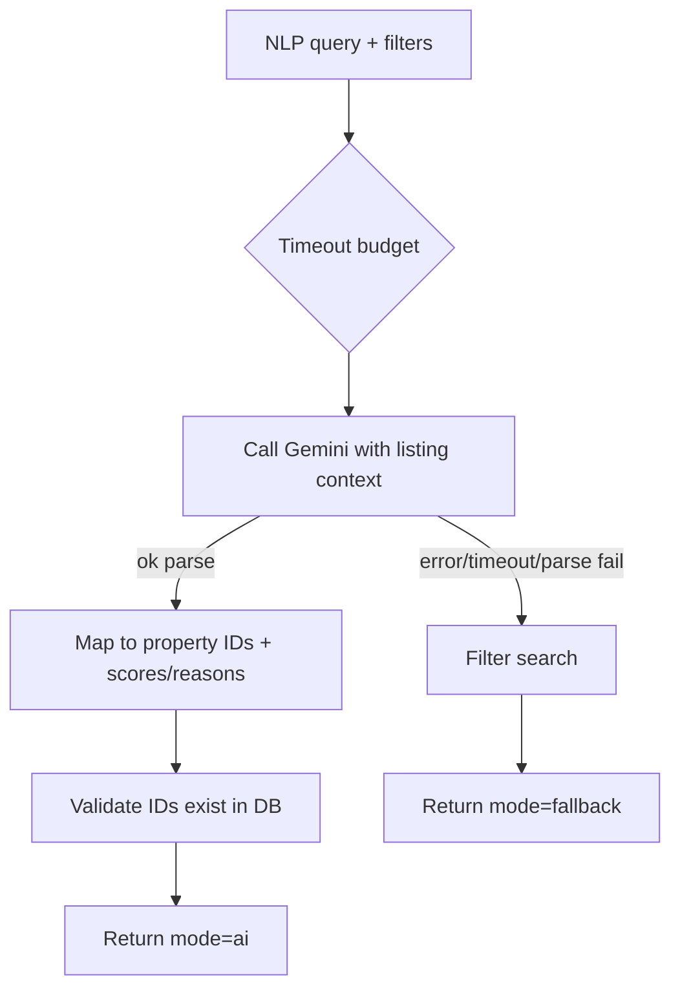

### 12.3 Safety

- Strip secrets from logs  
- Bound context size (top-N listings / summarized fields)  
- Tool/allowlist behavior as Requirements/SRS specify  
- HTML vendor dropdowns constrained to Gemini options  

---

## 13. Repository Pattern

### 13.1 Purpose

Isolate Prisma behind repositories so services stay testable and free of query duplication.

### 13.2 Pattern

```ts
// conceptual
class PropertyRepository {
  findPublished(filter, page): Promise<Page<Property>>
  findById(id): Promise<Property | null>
  create(data): Promise<Property>
  update(id, data): Promise<Property>
  // ...
}
```

### 13.3 Rules

- Repositories return domain/ persistence models—not Express `req`/`res`  
- No RBAC inside repositories  
- Use `select`/`include` deliberately; add indexes for hot paths  
- Transactions coordinated in services  

---

## 14. Service Pattern

### 14.1 Purpose

Encode business rules, orchestration, and authorization.

### 14.2 Example: LeadService

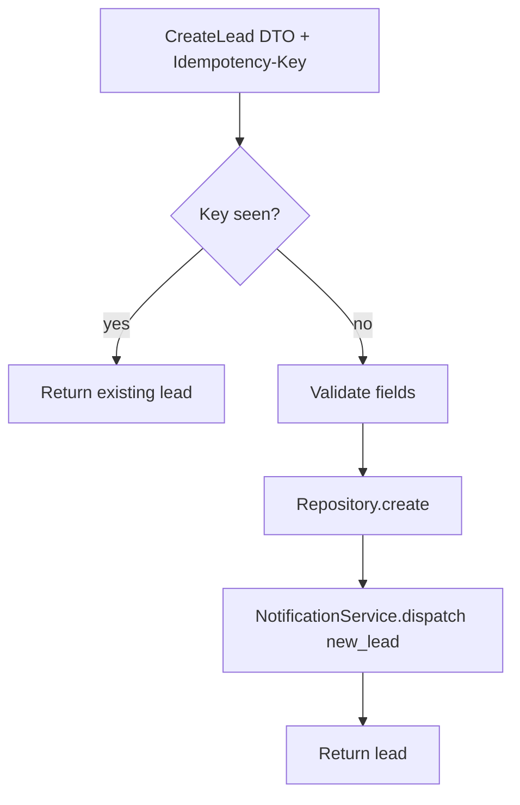

### 14.3 Service Catalog (MVP)

AuthService, UserService, AgentService, PropertyService, MediaService, SearchService/Orchestrator, FavoriteService, LeadService, VisitService, ChatService, LoanService, AiConfigService, NotificationService, CmsService, MetricsService, BulkImportService.

---

## 15. Middleware

| Middleware | Order | Function |
|------------|-------|----------|
| `requestId` | 1 | Correlation id |
| `requestLogger` | 2 | Structured access log |
| `cors` | 3 | Allowlist frontend origins |
| `rateLimit` | 4 | Stricter on `/auth`, `/ai` |
| `express.json` / multipart | 5 | Body parsing |
| route `validate` | 6 | Schema validation |
| `authenticate` | 7 | Optional/required per route |
| `requireRole` | 8 | RBAC |
| route handler | 9 | Calls service |
| `errorHandler` | last | Maps domain errors → envelope |

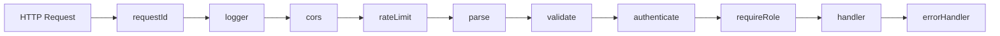

---

## 16. Validation

### 16.1 Layers

1. **UI** — HTML-required fields, inline errors (fidelity)  
2. **API validators** — zod/joi schemas on every write (authoritative)  
3. **Domain** — status transitions, publish readiness  

### 16.2 Shared Principles

- Server never trusts client-only checks  
- File MIME + size validation in media/bulk  
- Idempotency-Key validated for lead create  
- Price/range constraints per SRS  

---

## 17. Error Handling

### 17.1 Domain Errors

```ts
class AppError extends Error {
  code: string; status: number; details?: unknown;
}
```

Examples: `ValidationError` 422, `UnauthorizedError` 401, `ForbiddenError` 403, `NotFoundError` 404, `ConflictError` 409, `RateLimitError` 429, `AiUnavailableError` (mapped to fallback for search).

### 17.2 Mapping

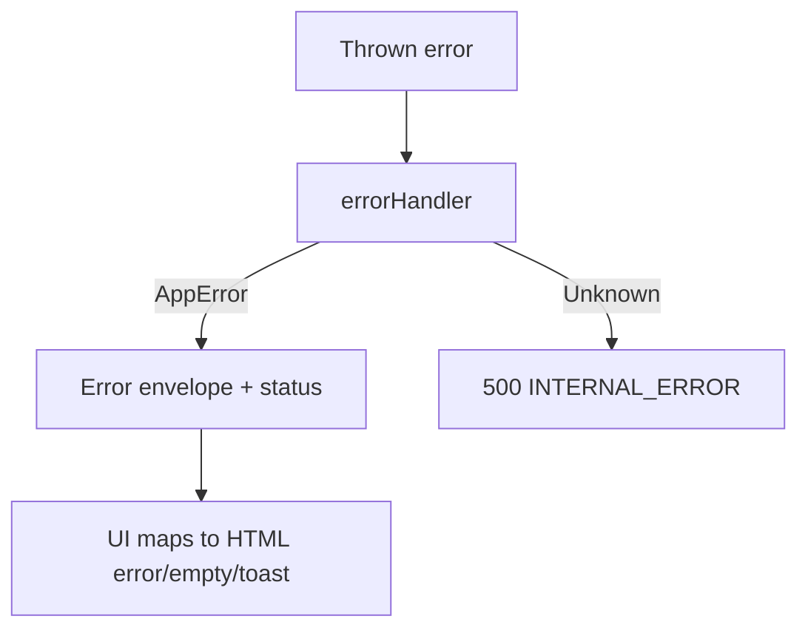

UI must prefer designed error states over generic alerts.

---

## 18. Logging

### 18.1 Standards

- Structured JSON logs on backend  
- Fields: `requestId`, `route`, `method`, `userId?`, `role?`, `latencyMs`, `level`  
- Events: auth success/fail, authz deny, property publish, lead create, AI success/fallback/fail, bulk validate/import, media failures  

### 18.2 Redaction

Never log passwords, tokens, Gemini API keys, or raw sensitive payloads.

### 18.3 Frontend

Production builds: minimal console noise; no secret leakage.

---

## 19. Configuration

### 19.1 Backend Config Module

Central `config/` loads env via validated schema (e.g. zod):

| Key | Purpose |
|-----|---------|
| `DATABASE_URL` | Postgres |
| `JWT_ACCESS_SECRET` / `JWT_REFRESH_SECRET` | Auth |
| `GEMINI_API_KEY` | AI |
| `EMAIL_*` | SMTP/provider |
| `CORS_ORIGINS` | Frontend origins |
| `STORAGE_ROOT` / cloud creds | Media |
| `PORT` | Listen port |
| `NODE_ENV` | environment |
| `AI_SEARCH_TIMEOUT_MS` | Fallback trigger |

### 19.2 Frontend Config

| Key | Purpose |
|-----|---------|
| `NEXT_PUBLIC_API_BASE_URL` | API base only |

No Gemini keys or DB URLs in frontend.

---

## 20. Environment Strategy

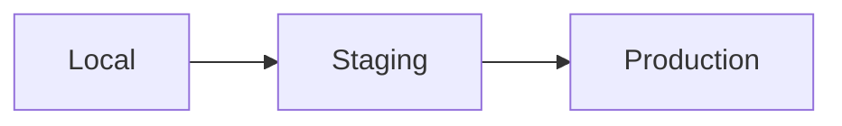

| Env | Frontend | Backend | DB | AI | Storage | Purpose |
|-----|----------|---------|----|----|---------|---------|
| Local | next dev | nodemon/tsx | local Postgres | real/dev key | local disk | Build features |
| Staging | Vercel preview/staging | Node host | staging Postgres | limited Gemini | staging bucket/disk | QA + E2E |
| Production | Vercel prod | hardened Node | HA Postgres | production Gemini | production storage | Live |

Rules:

- Separate secrets per env  
- Migrate before serving new schema  
- Seed only non-prod (or controlled prod bootstrap)  
- Feature flags must not expose Out-of-MVP Kanban/etc.  

---

## 21. Deployment Architecture

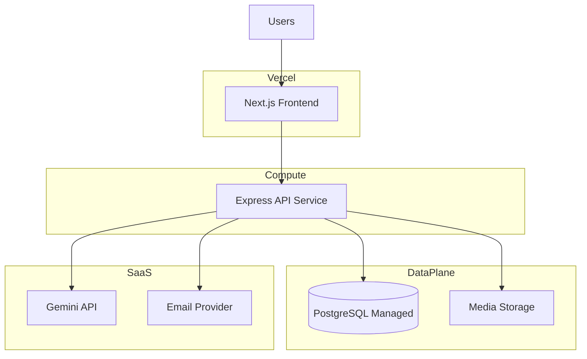

### 21.1 Deployment Notes

- Frontend: **Vercel** (Constitution)  
- Backend: container or Node process behind HTTPS reverse proxy / platform service  
- Health: `GET /api/v1/health` for probes  
- CI: lint, typecheck, tests, migrate checks before deploy  
- Rollback: previous image + migrate forward-only discipline  

### 21.2 Smoke After Deploy

Auth, property list/detail, AI search (or fallback), lead capture, admin login (Constitution).

---

## 22. Security Architecture

| Control | Implementation |
|---------|----------------|
| AuthN | Email/password + JWT |
| AuthZ | Role middleware + service checks |
| Data | Prisma parameterized queries |
| Transport | HTTPS only in staging/prod |
| Secrets | Env/secret manager; never git |
| AI | Server-side keys; rate limits |
| Uploads | MIME/size allowlists |
| CORS | Explicit allowlist |
| Headers | Helmet (or equivalent) recommended |
| XSS/CSRF | React escaping; CSRF strategy if cookie auth |
| Soft delete | Block auth for deleted/inactive |

Threat focus: credential stuffing (rate limit), IDOR on leads/properties (ownership checks), prompt injection (don’t execute unverified tool writes), bulk upload abuse (Admin-only + validation).

---

## 23. Scalability

### 23.1 MVP Scale Profile

Single-org workload: vertical scale + managed Postgres is sufficient initially.

### 23.2 Horizontal Levers (without redesign)

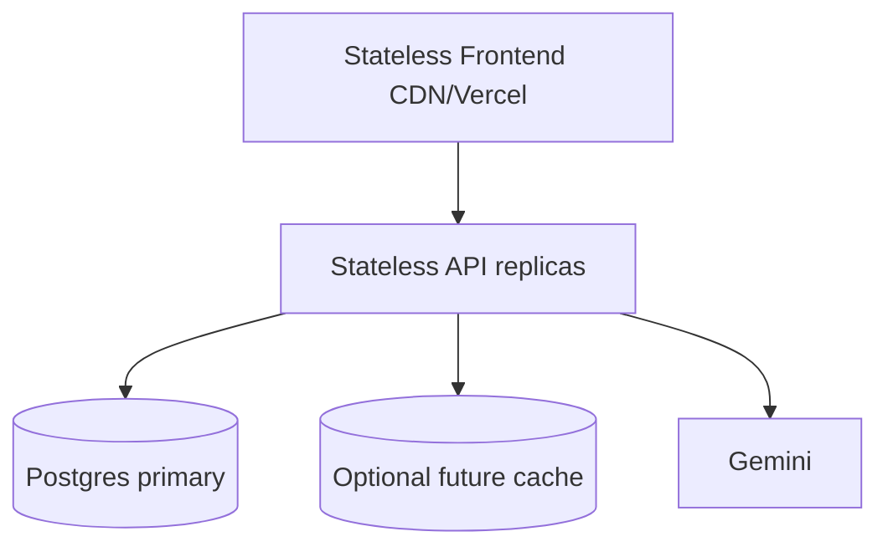

| Area | Tactic |
|------|--------|
| API | Stateless replicas behind LB |
| DB | Indexes, connection pooling (PgBouncer), read replica later if needed |
| Search | Bound Gemini context; cache featured/CMS; paginate always |
| Media | CDN in front of storage adapter |
| AI | Timeouts, concurrency limits, fallback path absorbs Gemini brownouts |
| Metrics | Pre-aggregate command-center snapshots if queries grow heavy |

### 23.3 Explicit Non-Goals Now

No Kafka, no microservices split, no multi-tenant routers—YAGNI until Constitution/PRD expand.

---

## 24. Future Expansion Architecture

Seams reserved **without implementing** excluded products:

| Future Capability | Extension Point |
|-------------------|-----------------|
| Kanban | Lead stage events + board UI module; keep list API stable |
| Activity timeline | `LeadEvent` store separate from command-center feed |
| Reminders/automation | Job runner + rule engine module |
| Virtual tours / video | Media `kind` expansion + player feature |
| SMS/WhatsApp/Push | `NotificationChannel` adapters beside email/in-app |
| Multi-tenancy | `org_id` on aggregates (requires Constitution amendment) |
| Alternate LLMs | Forbidden unless Constitution amended; prefer filter fallback |
| Auditing | Append-only `AuditLog` + Super Admin UI |
| Transactions/e-sign | New bounded context, not property core rewrite |

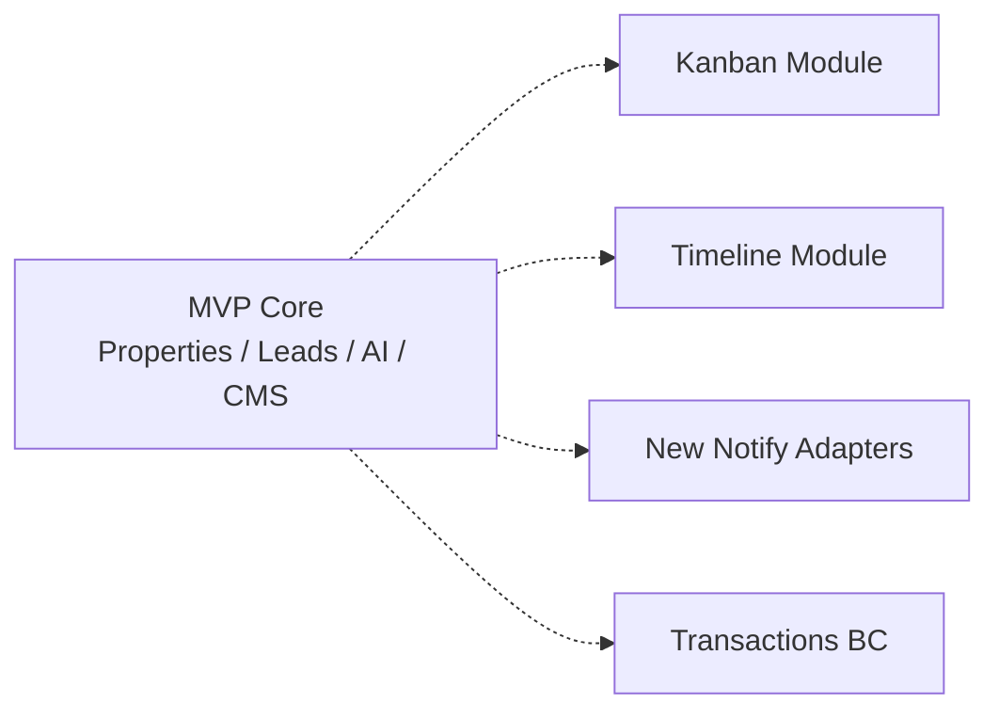

---

## 25. Cross-Cutting Quality Architecture

| Concern | Approach |
|---------|----------|
| Testing | Unit services/mappers; integration API+DB; E2E critical journeys |
| Observability | Structured logs + health; metrics hooks for AI latency/fallback rate |
| Contracts | SRS Appendix D shapes; breaking changes versioned |
| UI QA | Screenshot vs `design_reference` gates |
| DoD | Constitution screen completion + real API (no leftover mocks) |

---

## 26. Architecture Decision Records (Summary)

| ADR | Decision | Rationale |
|-----|----------|-----------|
| ADR-001 | Monolith modular backend (Express) | KISS for single-org MVP |
| ADR-002 | Next.js App Router frontend on Vercel | Constitution |
| ADR-003 | Prisma + PostgreSQL | Constitution; typed migrations |
| ADR-004 | Gemini-only AI adapter | Constitution AI policy |
| ADR-005 | Filter fallback not multi-LLM | Reliability without policy breach |
| ADR-006 | Role RBAC only | Constitution |
| ADR-007 | Feature-based frontend folders | Constitution maintainability |
| ADR-008 | Repository + Service layers | Clean Architecture / testability |
| ADR-009 | Storage port/adapter | Dev local → prod cloud without UI contract change |
| ADR-010 | Defer Kanban/timeline modules | MVP exclusions |

---

## 27. Implementation Mapping to Docs

| Doc | Architecture use |
|-----|------------------|
| Constitution | Stack, process, exclusions, layering rules |
| PRD | Modules, screens, journeys to feature folders |
| SRS | API/DB/RBAC/AI/validation acceptance for services |

---

## Appendix A — Target Runtime Topology (Production)

| Process | Replicas | Notes |
|---------|----------|-------|
| Next.js (Vercel) | Platform-managed | CDN edge |
| Express API | 2+ | Stateless |
| PostgreSQL | Managed primary | Backups on |
| Worker (future) | 0 in MVP | For reminders/automation later |

---

## Appendix B — Revision History

| Version | Date | Notes |
|---------|------|-------|
| 1.0.0 | 2026-07-30 | Initial production architecture from Constitution, PRD, SRS |

---

**End of Production Architecture**

*All implementers—human and AI—must follow this architecture together with the Constitution, PRD, and SRS. UI remains bound to `design_reference` HTML.*
